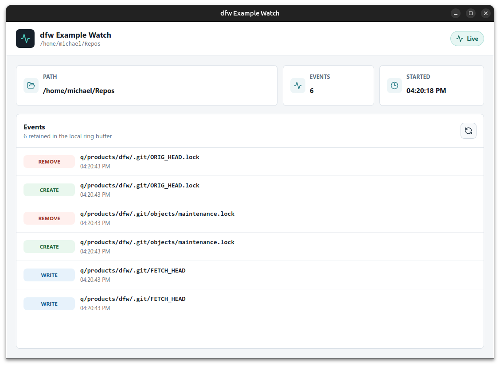
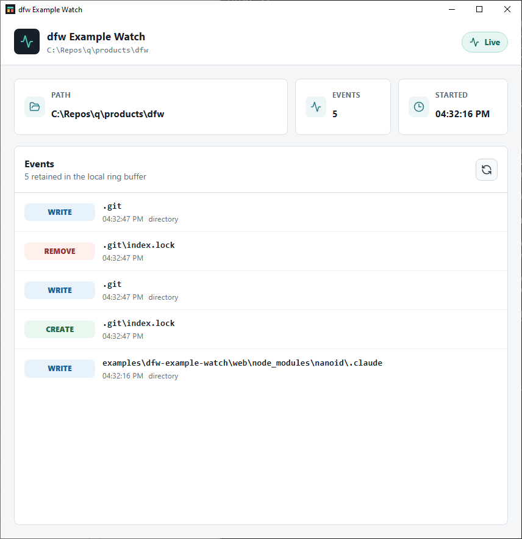
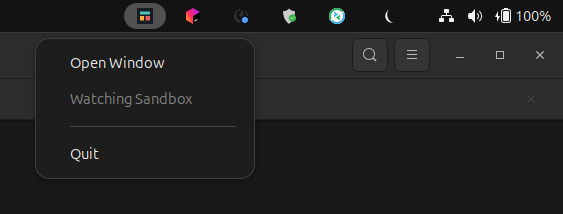
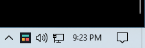

# dfw

**Native desktop windows for Go HTTP apps.**




`dfw` is a small Go library that wraps an HTTP server and a webview
window into a single desktop application. You bring the server and the
web UI; `dfw` provides the process, the window, and — if you want
it — a system tray daemon to keep the server resident between window
sessions.

It is intentionally narrow. The library does not ship a UI framework,
a JavaScript-to-Go bridge, a request proxy, native file dialogs, a
native menu bar, single-instance enforcement, or packaging tooling.
Products own their HTTP API, their web UI, their background work, and
their distribution; `dfw` just gives the result a window.

## The Three Modes

`dfw` exposes three entry points. Each is one function call from your
product's `main`.

### `dfw.Run` — single window, single process

The HTTP server and the webview run in the same process. The window
opens, navigates to the loopback address, and the function returns
when the user closes the window.

| Linux | Windows |
| :---: | :---: |
|  |  |

### `dfw.Daemon` — tray-resident HTTP daemon

A long-running process owns the HTTP server and shows a system tray
icon. Background work keeps running with the tray visible; opening a
window is a separate step.

| Linux | Windows |
| :---: | :---: |
|  |  |

### `dfw.Window` — webview attached to a daemon

A separate process that opens a webview pointing at a running daemon.
Spawned by the daemon (via `dfw.SpawnSelf`, which re-executes the
daemon's binary) or launched independently by the user. Multiple
`Window` processes can attach to the same daemon.

## Minimal Usage

```go
package main

import (
    "image"
    "net"
    "net/http"

    "github.com/michaelquigley/dfw"
)

func main() {
    _ = dfw.Run(dfw.App{
        AppID:       "com.example.hello",
        Title:       "Hello dfw",
        InitialSize: image.Pt(900, 600),
        Listen: func() (*http.Server, net.Listener, error) {
            listener, err := net.Listen("tcp", "127.0.0.1:0")
            if err != nil {
                return nil, nil, err
            }
            mux := http.NewServeMux()
            mux.HandleFunc("/", func(w http.ResponseWriter, _ *http.Request) {
                _, _ = w.Write([]byte("<h1>Hello, dfw.</h1>"))
            })
            return &http.Server{Handler: mux}, listener, nil
        },
    })
}
```

For a complete product — embedded React UI, filesystem watcher,
daemon + window split — see [`examples/dfw-example-watch`](examples/dfw-example-watch)
and the [example walkthrough](docs/current/example.md).

## Platform Support

| Platform | Webview | Tray | Window position |
| :--- | :--- | :--- | :--- |
| Linux | WebKitGTK 4.1 | StatusNotifier / AppIndicator | persisted |
| Windows | WebView2 | system tray | persisted |
| macOS | deferred | deferred | not persisted |

Building against `dfw` requires a CGO-capable toolchain plus the
platform's native webview headers. See [docs/current/building.md](docs/current/building.md)
for distro-specific package names and the full build sequence.

## Status

Initial implementation. The library is feature-complete for the v1
scope on Linux and Windows. macOS is deferred until the webview and
window-position integrations are exercised; the unsupported build
tags keep the library compiling on macOS but window position is not
persisted.

## Documentation

- [Architecture](docs/current/architecture.md) — the three entry
  points, the process topology, and why the HTTP server is the system
  boundary.
- [Building](docs/current/building.md) — toolchain, distro packages,
  Windows subsystem, the example's React bundle prerequisite.
- [Runtime](docs/current/runtime.md) — on-disk state, environment
  variables, daemon discovery, devtools, the tray menu shape.
- [Example walkthrough](docs/current/example.md) — `dfw-example-watch`
  end to end.

## Quick Build

```sh
go build ./...
go test ./...
```

The example app embeds a React bundle that needs to be built first:

```sh
cd examples/dfw-example-watch/web
pnpm install
pnpm build
```

Full build instructions, including platform prerequisites, live in
[docs/current/building.md](docs/current/building.md).

## License

See [LICENSE](LICENSE) and [NOTICE](NOTICE).
