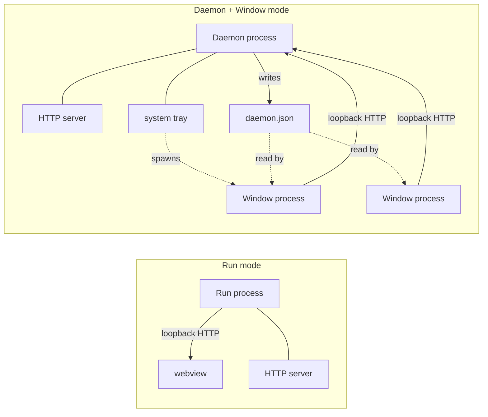

# Architecture

`dfw` wraps a Go HTTP server in a native desktop webview window. It does not
ship a UI framework, a JavaScript-to-Go bridge, a request proxy, or any kind
of distribution tooling. The product owns its HTTP API and its web UI; `dfw`
only owns the process, window, and tray lifecycle around them.

The library exposes three entry points. Each is a single function call from
the product's `main`; the function blocks until the user-facing lifecycle
completes.

## The Three Entry Points

### `dfw.Run(App)`

One process. The HTTP server and the webview window run together, navigation
points at the listener's loopback address, and the function returns when the
user closes the window. Use this for a single-window desktop application
where the server and window live and die together.

### `dfw.Daemon(DaemonApp)`

A tray-resident process. Owns the HTTP server and any background work,
writes a `daemon.json` runtime file so window clients can discover its
address, and shows a system tray icon with a menu. The function returns when
the daemon is shut down via the tray menu (or on fatal error). The daemon
itself does not open a window — it relies on a separate `Window` process for
that.

### `dfw.Window(WindowApp)`

A webview-only process that connects to a running daemon. Resolves the
daemon address from `DFW_DAEMON_ADDR` (falling back to the `daemon.json`
runtime file), opens a webview, and navigates to it. Returns when the user
closes the window. Multiple `Window` processes can connect to the same
daemon concurrently.

## Process Topology

Window processes can be spawned by the daemon (typically via `dfw.SpawnSelf`,
which re-executes the daemon's own binary with the appropriate subcommand and
the `DFW_DAEMON_ADDR` environment variable populated), or launched
independently by the user — in which case the runtime file provides
discovery.

## The HTTP Server Is The System Boundary

The product implements `app.Listen`, which returns a configured (but not yet
started) `*http.Server` and an open `net.Listener`. From there, `dfw` owns
the lifecycle: it calls `server.Serve(listener)` in a supervisor goroutine,
shuts the server down cleanly on exit, and propagates serve failures so the
window terminates rather than orphans.

This boundary is deliberate. The product owns routing, middleware, embedded
static asset serving, websockets, authentication, and any other HTTP
concern. `dfw` does not introspect the routes; it does not proxy requests;
it does not even know whether the server is serving HTML, JSON, or both. The
webview points at `http://<listener.Addr()>` and the product takes it from
there.

The shape lets a product:

- Embed its compiled web bundle via `//go:embed` and serve it from a static
  handler.
- Add API routes under any path scheme it wants.
- Stream events to the UI via websockets or server-sent events.
- Run any background goroutines it needs alongside the server — `Listen` can
  start them before returning, since `dfw` doesn't take over the goroutine
  until `Serve()` runs.

The product remains a normal Go HTTP service; `dfw` just gives it a window.

## Non-goals

`dfw` v1 deliberately does not provide:

- A JavaScript-to-Go bridge. The web UI talks to the product's HTTP API,
  not to Go through a postMessage channel.
- Native menus or dialogs beyond the system tray. File pickers, modals, and
  context menus are web-side concerns.
- Request proxying. The webview navigates to the HTTP server directly.
- Single-instance enforcement. Products that need this implement it
  themselves (lock files, port detection, named mutex on Windows, etc.).
- Multi-window in a single process. `Run` is one window; multi-window
  scenarios use `Daemon` + multiple `Window` processes.
- Packaging or distribution tooling. Code signing, installer generation,
  auto-update — all out of scope.

These choices keep the library narrow enough that a product can adopt it
without taking on a framework. If something on this list becomes essential
to a real product, it earns inclusion through that pressure.

## Related

- [building.md](building.md) — toolchains, platform support, and how to
  compile against `dfw`.
- [runtime.md](runtime.md) — what's on disk, what's in the environment, and
  the tray menu shape.
- [example.md](example.md) — a walkthrough of `dfw-example-watch`, the
  reference product.
